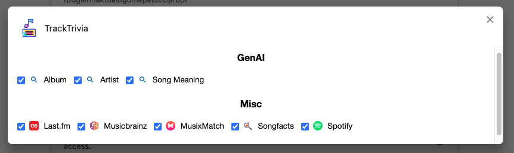

# Track Trivia

## Motivation

- Switch to Info Pages using Last.fm & Artist,Album,Track in the URL

## Install

you have 2 options ...

### a) build yourself from source code

This extention uses Node.js

1. Install Node.js
1. Install the dependencies: npm install
1. Build the extension: npm run build
1. The extension is built in the `dist` directory
1. Add to your Chrome/Firefox
   - Chrome: chrome://extensions/ -> Load unpacked
1. Optional:

   Increase the build version before 'Build the extension' in Powershell (if needed):
   - Set-ExecutionPolicy -ExecutionPolicy RemoteSigned -Scope Process    (optional in case of security warning)
   - .\inc_patch.ps1

### b) Load unpacked dist directory from github

1. Download the /dist Directory from github (Clone the Code or Code -> Download ZIP) to a Directory of of your choice
1. Add to your Chrome/Firefox
   - Chrome: chrome://extensions/ -> Load unpacked

## How to use

1. https://open.spotify.com/ and play a track 
2. Open your lastfm Userpage (mine is https://www.last.fm/user/limex)
3. Select one of your recently played tracks
4. You will see an note/book icon near URL bar. Click it.
5. Select Wikipedia, for example.
6. You can jump to Wikipedia for the played track/artist
7. Left click: Open in a new tab. Middle click: Open the same tab.

This should work on all lastfm pages as long as there is Artist/Track/Album Information listed in the URL 

## Settings

#FIXIT

Show/hide maps:

1. Right click the earth icon,
1. Select "Options"
1. It might take some seconds for the popup to apear. Collecting all the data takes some time.
1. Check/uncheck each map to show/hide it.

## ToDo

???

## Screenshots

Button opens a popup when pressed on supported sites:

Enable supported Sites for the Popup:

