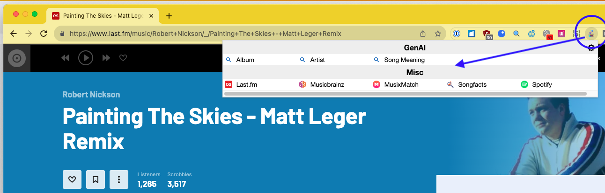

# tracktrivia

## Motivation

- Some cleanup done. Added new maps
- Most of the maps didn't calculate the lat/lon/zoom calculation that is needed to open a new map from.
- Chanced the Categories, because some grew to big, while others remained small.
- Switched behavour in the Map Popup: Left Click now opens in new Tab, Middle Click opens in same Tab
- Sorted the Maps by Name
- Show Descriptions while MouseOver in Options Popup
- Existing Extension was listing the Categories in Columns. This limited the number of Categories.
  Also was a waste of space with smaller Categories. 
  Solution: Render Categories in rows

## Install

you have 2 options ...

### b) from source code

This extention uses Node.js

1. Install Node.js
1. Install the dependencies: npm install
1. Build the extension: npm run build
1. The extension is built in the `dist` directory
1. Add to your Chrome/Firefox
   - Chrome: chrome://extensions/ -> Load unpacked
1. Optional:

   Increase the build version before 'Build the extension' in Powershell (if needed):
   - Set-ExecutionPolicy -ExecutionPolicy RemoteSigned -Scope Process    (optional in case of security warning)
   - .\inc_patch.ps1

### c) Load unpacked dist directory from github

1. Download the /dist Directory from github (Clone the Code or Code -> Download ZIP) to a Directory of of your choice
1. Add to your Chrome/Firefox
   - Chrome: chrome://extensions/ -> Load unpacked

## How to use

#FIXIT

1. Open Google map, for example (https://www.google.de/maps/place/Vienna/@48.2092464,16.850411,11z)
1. You will see an earth icon near URL bar. Click it.
1. Select OpenStreetMap, for example.
1. You can jump to OpenStreetMap at the same position
1. Left click: Open in a new tab. Middle click: Open the same tab.

## Settings

#FIXIT

Show/hide maps:

1. Right click the earth icon,
1. Select "Options"
1. It might take some seconds for the popup to apear. Collecting all the data takes some time.
1. Check/uncheck each map to show/hide it.

## ToDo

- ??

## Screenshots

## Current (2023/08/03) supported track info services

#FIXIT

## Similar softwares

#FIXIT
